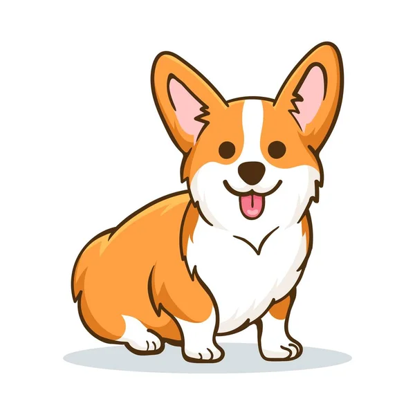
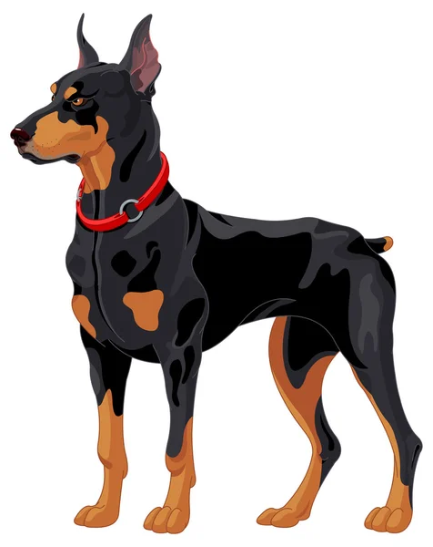
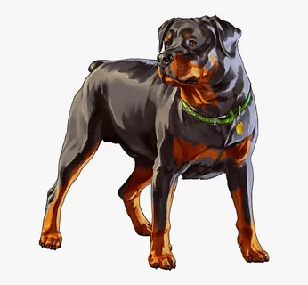
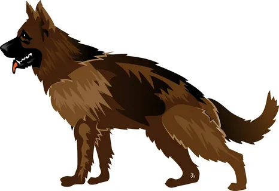

 

 

3 contracts

1. Basic NFT.
    Corgi.
    (Hosted on IPFS)

2. Random IPFS NFT.
    When we mint NFT, we will trigger a Chainlink VRF call to get us a random number.
    Using that number, we will get a random NFT.
    Doberman, Shepherd, Rottweiler.
    Doberman is super rare.
    Rottweiler is sort of rare.
    Shepherd is common.
    Users have to pay to mint NFT. The owner of the contract can withdraw the ETH.
    (Hosted on IPFS/Pinata)

3. Dynamic SVG NFT.
    If price of ETH is above X -> thump up.
    If it is below -> thumb down.
    (Hosted 100% on-chain)